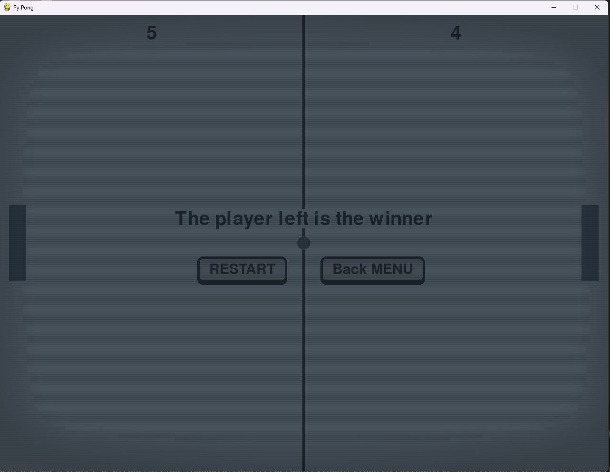

<h1 align='center'>Crazy Pong</a></h1>
<b>

This a Pong like create with python and pygame. 
Cathodic ray screen effect. 
The ball speed increase every lateral collision with a paddle and back to default speed after player win the game. 
Use Pygame Surface to render the ball and the paddles. 

# Requirements
- pygame 2.5 or more recent
- python 3.10 or more recent

# Game type
- Player vs Player.
- Player vs AI.

# Controls:
- Player 1: R and F (based on an AZERTY KEYBOARD)
- Player 2: KEY UP and KEY DOWN.
- Leave current game: ESCAPE or BACKSPACE.
 

# Screenshots:

 

# Last Update:
- Switch to pygame-ce.
- Improve ball physics (movement and collisions with paddles.)
- Improve Starting menu rendering.