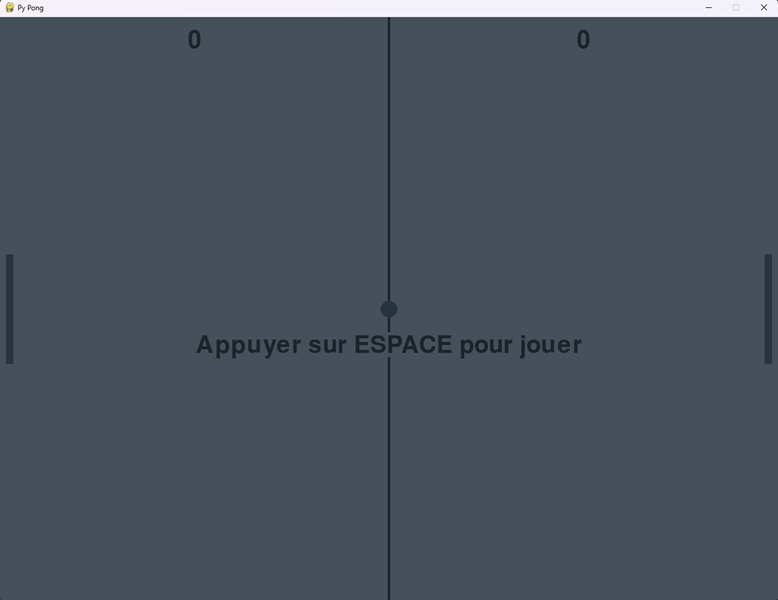

<h1 align='center'>PyPong</a></h1><p align='center'><b>

This a Pong like create with python and pygame.

Use Pygame Surface to render the ball and the paddles.
</br></br>
<p align="center"></p>
</br>
# Controls:

- Player 1: Z and S (based on an AZERTY KEYBOARD)
- Player 2: KEY UP and KEY DOWN.
</br></br>
# Translations:
The locales are in french but you can translate it to english in `locales.py` from there.
```python
class Locales:
    GAME_NAME = str("Py Pong")
    START_TXT = str("Press SPACE to start")
    RESTART_TXT = str("Press SPACE to restart")

    WIN_TXT = str("The player {player} win")
    PLAYER_LEFT = str("left")
    PLAYER_RIGHT = str("right")
```