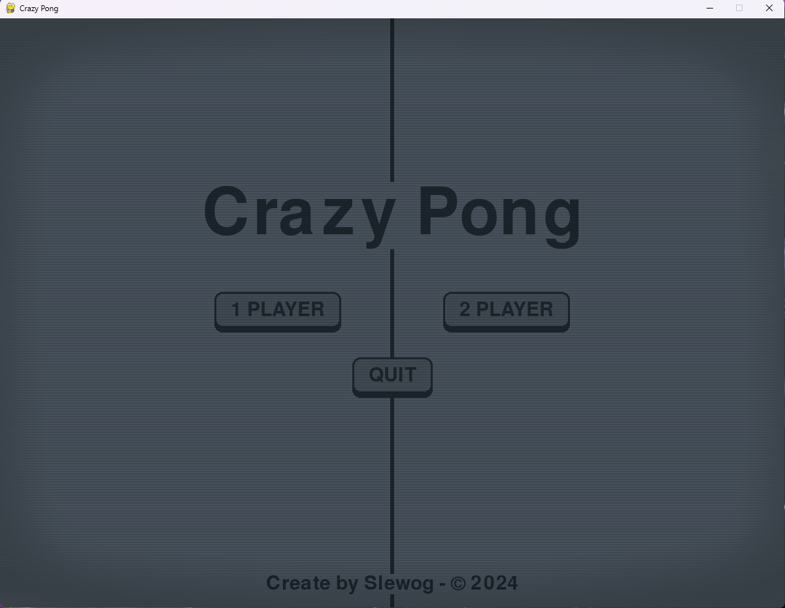

<h1 align='center'>PyPong</a></h1>
<b>

This a Pong like create with python and pygame. 
Use Pygame Surface to render the ball and the paddles. 
Play with two players or players vs AI. 

# Controls:
- Player 1: Z and S (based on an AZERTY KEYBOARD)
- Player 2: KEY UP and KEY DOWN.
 

# Screenshots:

 

# Todo:
- Starting countdown.
- Create score system (add score to a player when ball collide a horizontal wall)
- Render score for every players.
- Add sounds effects.